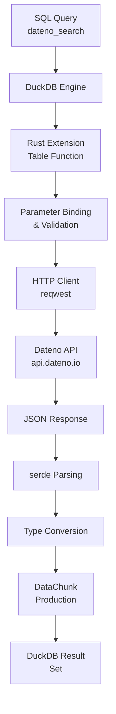

# Creating a DuckDB Extension in Rust for Dateno Dataset Search

A comprehensive guide to bridging DuckDB's analytical capabilities with Dateno's dataset catalog through native extension development

## TL;DR

You want to build a **DuckDB extension in Rust** that exposes Dateno's dataset search API as a SQL table function. Use the **`duckdb-rs` crate** with the `vtab` feature for table functions, **`reqwest`** for HTTP, and **`serde`** for JSON parsing. The core challenge is bridging Rust's async HTTP client with DuckDB's sync extension API while maintaining clean SQL ergonomics. Plan for 6 phases: environment setup, core extension structure, API integration, result materialization, testing, and distribution. The `duckdb-ext-rs-template` accelerates scaffolding, and Cursor IDE's AI assistance helps with boilerplate generation.

## Table of Contents

- [Project Overview](#project-overview-and-architecture)
- [Architecture](#technical-stack-components)
- [Dateno Integration](#dateno-search-engine-integration)
- [Development Roadmap](#development-roadmap)
- [Implementation Details](#implementation-details)
- [Testing & Validation](#testing-and-validation)
- [Packaging & Distribution](#packaging-and-distribution)

## Project Overview and Architecture

### Core Objective: Enable metadata-based dataset discovery within DuckDB

The fundamental purpose of this extension is to **bridge the gap between DuckDB's analytical capabilities and external dataset catalogs**, specifically the Dateno search engine. Dateno operates as a comprehensive metadata aggregator for open data repositories, indexing datasets from government portals, research institutions, and international organizations.

By embedding Dateno search functionality directly into DuckDB as a native extension, users gain the ability to discover, evaluate, and potentially ingest datasets without leaving their SQL workflow. This integration eliminates context switching between separate tools for data discovery and data analysis, creating a seamless experience where dataset metadata becomes queryable and composable with existing database operations.

> This represents a shift from procedural, tool-chaining approaches to **declarative, integrated data discovery** where the boundary between "finding data" and "using data" becomes permeable.
> 
> [Reference: Dateno Developer Guide](https://docs.dateno.io/docs/developer-guide/using-filters/)

### User Experience: SQL-native access to external dataset catalogs

The ultimate measure of success is the **naturalness with which users incorporate external dataset discovery into existing SQL workflows**. This requires thoughtful interface design respecting SQL conventions and DuckDB-specific patterns.

**Function Naming Convention**: Follows DuckDB's snake_case convention with clear purpose indication

**Example Workflow**:
```sql
SELECT * FROM dateno_search(
  'climate data',
  ARRAY['source.countries.name=Canada']
) LIMIT 10;
```

### Extension Architecture Flow



## Technical Stack Components

### DuckDB Extension Framework

The **`duckdb-rs` crate** provides foundational bindings for creating DuckDB extensions in Rust, exposing the C extension API through idiomatic Rust interfaces.

**Key Features**:
- libduckdb_sys FFI access
- Arrow format interoperability
- Ergonomic extension wrappers
- vtab feature for table functions

[Reference: duckdb-rs Documentation](https://docs.rs/duckdb/)

### HTTP Client

**`reqwest`** is the de facto standard HTTP client for Rust, offering an ergonomic, async-first API with comprehensive feature coverage.

**Capabilities**:
- Connection pooling
- Request/response middleware
- Robust JSON serialization
- Configurable timeouts

[Reference: reqwest Documentation](https://docs.rs/reqwest/)

### Data Serialization

JSON handling centers on the **`serde` ecosystem**, with `serde_json` providing standard JSON serialization and deserialization.

**Features**:
- Derive macros for automatic parsing
- Compile-time verification
- Flexible field mapping
- Nullable field handling

[Reference: serde Documentation](https://serde.rs/)

## Dateno Search Engine Integration

### API Endpoint Structure

**Base Configuration**:

**Base URL**: `https://api.dateno.io/search/0.2/query`

**Authentication Methods**:
- **Query parameter**: `?apikey=...` (development)
- **Bearer token**: Authorization header (production)

**Key Parameters**:

- **q** (required): Full-text search query string
- **limit** (optional): Result pagination control (10-100)
- **filters** (repeated): Metadata-based refinement

[Reference: Dateno Developer Guide](https://docs.dateno.io/docs/developer-guide/using-filters/)

### Metadata Filter Syntax

The filter syntax uses **structured string format combining field path, operator, and value**: `filters="field.path"="value"`

**Example Implementation**:
```
filters="source.countries.name"="Canada"
filters="source.langs.id"="FR"
```

Searches for Canadian datasets with French content

**Filter Features**:
- **Nested Field Access**: Dot-notation for hierarchical metadata traversal
- **Multiple Filters**: AND logic via repeated parameters
- **URL Encoding**: Proper quoting and escaping required

[Reference: Dateno Developer Guide](https://docs.dateno.io/docs/developer-guide/using-filters/)

## Development Roadmap

### Phase 1: Environment Setup
- Rust toolchain installation
- Cursor IDE configuration
- Project scaffolding
- Dependency management

### Phase 2: Core Structure
- Extension entry points
- Table function registration
- Parameter binding
- Return schema definition

### Phase 3: API Integration
- HTTP client initialization
- Request construction
- Async runtime handling
- Response parsing

### Phase 4: Result Materialization
- Row iterator implementation
- Type mapping
- Null handling
- Chunked production

### Phase 5: Testing & Validation
- Unit tests with mocks
- Integration tests
- SQL-level tests
- Performance benchmarks

### Phase 6: Packaging & Distribution
- Cross-compilation
- Extension metadata
- Installation packaging
- Documentation

## Implementation Details

### Phase 1: Environment Setup

#### Rust Toolchain Installation

```bash
curl --proto '=https' --tlsv1.2 -sSf https://sh.rustup.rs | sh

# Add required components
rustup component add rust-src
rustup target add x86_64-unknown-linux-musl
```

Verify installation with `rustc --version` and `cargo --version`

#### Cursor IDE Configuration

```json
{
  "rust-analyzer": {
    "cargo": {
      "features": ["vtab"]
    },
    "checkOnSave": {
      "command": "clippy"
    }
  }
}
```

Configure rust-analyzer with vtab feature awareness

#### Project Dependencies

```toml
[dependencies]
duckdb = { version = "1.4", features = ["vtab"] }
reqwest = { version = "0.12", features = ["json", "rustls-tls"] }
serde = { version = "1.0", features = ["derive"] }
tokio = { version = "1", features = ["rt-multi-thread"] }
chrono = { version = "0.4", features = ["serde"] }
thiserror = "1.0"
```

[Reference: duckdb-rs Documentation](https://docs.rs/duckdb/)

### Phase 2: Core Extension Structure

#### Extension Entry Points

```rust
#[no_mangle]
pub unsafe extern "C" fn dateno_duckdb_ext_init(
    db: *mut c_void,
    info: *mut c_void,
    error: *mut *mut c_void,
) -> u32 {
    vtab::register_table_function::<DatenoSearchFunction>(db, info, error)
}

#[no_mangle]
pub unsafe extern "C" fn dateno_duckdb_ext_version() -> *const u8 {
    "0.1.0\0".as_ptr()
}
```

#### Table Function Registration

```rust
impl VTab for DatenoSearchFunction {
    type InitData = DatenoSearchInitData;
    type BindData = DatenoSearchBindData;

    fn name() -> &'static str { "dateno_search" }
    
    fn parameters() -> Option<Vec<LogicalType>> {
        Some(vec![
            LogicalType::new(Varchar),           // query
            LogicalType::list(Varchar),          // filters
            LogicalType::new(Bigint),            // limit
        ])
    }
}
```

[Reference: DuckDB Table Functions](https://duckdb.org/docs/stable/clients/c/table_functions.html)

### Phase 3: API Integration

#### HTTP Client Configuration

```rust
let client = Client::builder()
    .connect_timeout(Duration::from_secs(10))
    .timeout(Duration::from_secs(60))
    .pool_max_idle_per_host(10)
    .user_agent("dateno-duckdb-ext/0.1.0")
    .build()?
```

#### Request Construction

```rust
let mut url = Url::parse(
    "https://api.dateno.io/search/0.2/query"
)?;

url.query_pairs_mut()
    .append_pair("q", &query)
    .append_pair("limit", &limit.to_string());

for filter in &filters {
    let (key, value) = parse_filter(filter)?;
    let encoded = format!("\"{}\"=\"{}\"", key, value);
    url.query_pairs_mut()
        .append_pair("filters", &encoded);
}
```

#### Response Parsing

```rust
#[derive(Deserialize)]
struct SearchResponse {
    total: usize,
    results: Vec<Dataset>,
}

let response: SearchResponse = client
    .execute(request).await?
    .json().await?
```

[Reference: Dateno Developer Guide](https://docs.dateno.io/docs/developer-guide/using-filters/)

## Testing and Validation

### Unit Testing Strategy

Use **`wiremock` or `mockito`** for HTTP mocking to test parsing logic without external dependencies.

```rust
#[test]
fn test_search_parsing() {
    let mock_server = MockServer::start();
    Mock::given(method("GET"))
        .and(path("/search/0.2/query"))
        .respond_with(ResponseTemplate::new(200)
            .set_body_json(json!({
                "total": 1,
                "results": [{"id": "test-1", "title": "Test"}]
            })))
        .mount(&mock_server);
    
    let client = DatenoClient::new(&mock_server.uri());
    let results = client.search("test", &[]).unwrap();
    assert_eq!(results[0].title, "Test");
}
```

[Reference: mockito Documentation](https://docs.rs/mockito/)

### Integration Testing

Feature-gated tests for live API calls with proper credential management.

```rust
#[test]
#[ignore = "requires DATENO_API_KEY"]
fn test_live_search() {
    let key = env::var("DATENO_API_KEY").unwrap();
    let client = DatenoClient::with_key(&key);
    let results = client.search("climate", &["format=CSV"]).unwrap();
    assert!(!results.is_empty());
}
```

[Reference: Dateno Developer Guide](https://docs.dateno.io/docs/developer-guide/using-filters/)

### SQL-Level Testing

```sql
-- Load and basic functionality
LOAD 'dateno_duckdb_ext';
SELECT COUNT(*) > 0 FROM dateno_search('test', ARRAY[]);

-- Schema verification
DESCRIBE SELECT * FROM dateno_search('test', ARRAY[]) LIMIT 0;

-- Composability
WITH results AS (
  SELECT title, format FROM dateno_search('temperature', ARRAY[])
  WHERE 'NetCDF' = ANY(formats)
)
SELECT format, COUNT(*) FROM results GROUP BY format;
```

[Reference: DuckDB Table Functions](https://duckdb.net/docs/table-functions.html)

## Packaging and Distribution

### Cross-Compilation Strategy

| Target Platform | Toolchain | Notes |
|----------------|-----------|-------|
| x86_64-unknown-linux-gnu | Standard | Most Linux distributions |
| x86_64-unknown-linux-musl | cross | **Static linking, portable** |
| aarch64-unknown-linux-gnu | cross | ARM servers |
| x86_64-apple-darwin | Native/CI | Intel macOS |
| aarch64-apple-darwin | Native/CI | **Apple Silicon** |
| x86_64-pc-windows-msvc | Native/CI | Windows |

[Reference: duckdb-rs GitHub](https://github.com/duckdb/duckdb-rs)

### Extension Metadata & Installation

#### Extension Manifest

```toml
# extension.toml
name = "dateno"
version = "0.1.0"
duckdb_version = ">=0.10.0"
platforms = ["linux_amd64", "linux_arm64", 
              "osx_amd64", "osx_arm64", "windows_amd64"]
description = "Dateno dataset search integration"
```

#### Installation Process

```sql
-- Direct installation
INSTALL 'dateno' FROM 'https://your-repo.com/extensions';
LOAD 'dateno';

-- Or local file
INSTALL 'path/to/extension.duckdb_extension';
LOAD 'dateno';
```

[Reference: duckdb-rs GitHub](https://github.com/duckdb/duckdb-rs)

## Resources

- [duckdb-rs Documentation](https://docs.rs/duckdb/)
- [Dateno API Documentation](https://docs.dateno.io/)
- [DuckDB Table Functions](https://duckdb.org/docs/stable/clients/c/table_functions.html)
- [Rust Programming Language](https://www.rust-lang.org/)
- [Cursor IDE](https://www.cursor.com/)
- [serde Serialization](https://serde.rs/)

---

*Creating a DuckDB Extension in Rust for Dateno Dataset Search - Comprehensive Development Guide*
